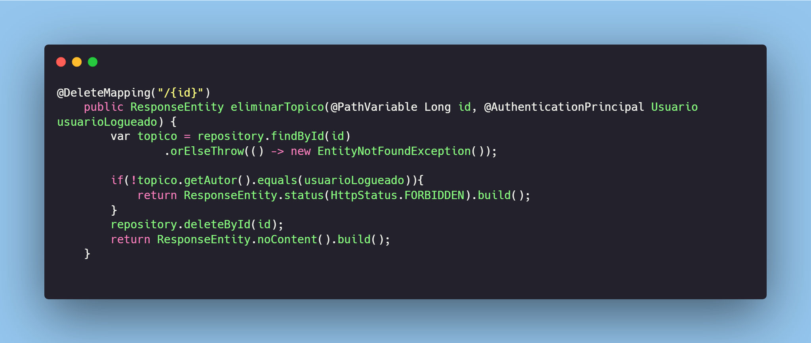
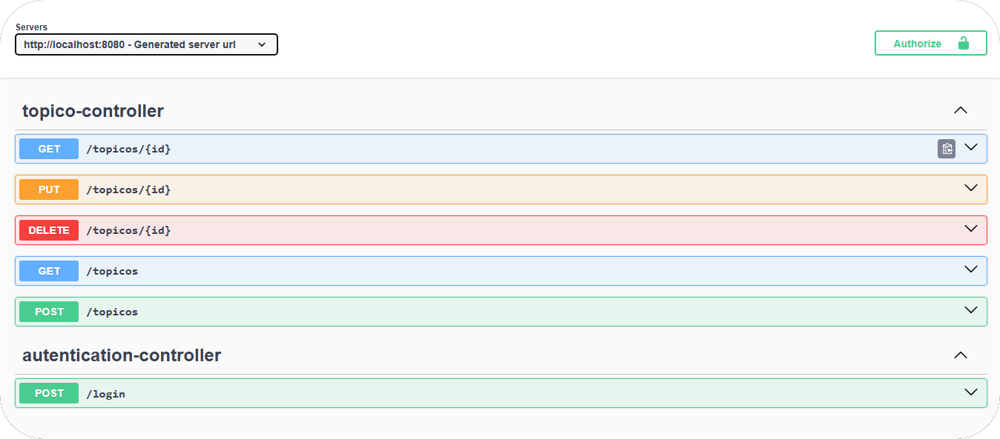

# 🚀 Challenge - ForoHub API
<p align="center">

</p>

## 🎯 Objetivo del proyecto propuesto
**ForoHub** es una API REST profesional diseñada para gestionar un foro de discusión técnica. El objetivo es replicar el comportamiento de una plataforma de preguntas y respuestas, enfocándose en la **seguridad stateless** y la integridad de los datos.

Este proyecto fue desarrollado como parte de la ruta de aprendizaje del programa **Alura-Oracle Next Education**, consolidando conocimientos avanzados de Java y Spring Boot mediante la aplicación de:
+ **Autenticación y autorización** con Spring Security y JWT.
+ **Persistencia de datos** relacionales con Spring Data JPA y MySQL.
+ **Documentación automatizada** con SpringDoc OpenAPI (Swagger).
## 🔐 Características y funcionalidades
1. 🔑 **Autenticación Stateless:** Implementación de login seguro que genera tokens JWT tras validar credenciales cifradas con BCrypt.
2. 📝 **Creación de tópicos con autoría automática:** El sistema identifica al autor mediante el token de sesión (usando `@AuthenticationPrincipal`), vinculándolo de forma íntegra sin necesidad de enviar el ID manualmente.
3. 📋 **Listado y detalle de tópicos:** Consulta paginada de todos los tópicos o visualización detallada de un mensaje específico.
4. 🛠️ **Edición protegida:** Permite actualizar título y mensaje, validando estrictamente que el usuario autenticado sea el dueño original del tópico.
5. 🗑️ **Eliminación de tópicos:** Remoción lógica o física de registros, restringida exclusivamente al creador del contenido para evitar manipulaciones ajenas.
6. ⚠️ **Tratamiento de errores:** Manejo centralizado de excepciones (400, 403, 404) para entregar respuestas claras al cliente.
## 🛠️ Tecnologías utilizadas
+ **Java17:** Lenguaje de programación principal.
+ **Spring Boot 3:** Framework para agilizar el desarrollo y la configuración.
+ **Spring Security:** Gestión de autenticación y protección de endpoints.
+ **MySQL:** Sistema de gestión de bases de datos relacionales.
+ **Flyway:** Herramienta de control de versiones para la base de datos (Migrations).
+ **SpringDoc OpenAPI:** Generación de la interfaz Swagger UI para documentación.

##🧪 Pruebas con Insomnia y Swagger
<p align="center">

</p>

### 📗 Swagger UI
Puedes interactuar con la API de forma visual accediendo a `http://localhost:8080/swagger-ui.html`. Para endpoints protegidos:
1. Genera un token en /login.
2. Haz clic en el botón **"Authorize"** y pega tu token Bearer.
### 💜 Insomnia
Importa la colección de endpoints incluida en el repositorio. Asegúrate de configurar la pestaña de Auth como **Bearer Token** en las peticiones de Tópicos tras haber realizado el login exitoso.
## 🚀 Guía de Inicio Rápido
Para poner en marcha el proyecto en tu entorno local, sigue estos pasos:
## 🧬 Clonar el repositorio
```shell
git clone https://github.com/Luisleonla/forohub.git
```
## ⚙️ Configuración de variables de entorno
Para que la aplicación corra sin problemas y proteja información sensible, configura las siguientes variables en tu sistema o IDE: `DATASOURCE_URL`, `DATASOURCE_USERNAME`, `DATASOURCE_PASSWORD` y `JWT_SECRET`. Crea una base de datos MySQL (ej. `forohub_db`). No es necesario crear las tablas manualmente, ya que **Flysay** las generará automáticamente al iniciar la aplicación.

## 🏗️ Estructura de la Base de Datos
El diseño utiliza una estructura relacional para garantizar la trazabilidad:
+ `USUARIO`: Almacena credenciales y datos de perfil.
+ `TOPICO`: Contiene la información de los mensajes y una relación `@ManyToOne` con la tabla de usuarios, asegurando que cada tópico tenga un autor válido en la base de datos.
## ▶️ Ejecución
Puedes ejecutar la aplicación desde tu IDE o mediante la terminal con el comando:
```shell
./mvnw spring-boot:run
```
<p align="center"> <strong>Luis Antonio Artiaga León</strong>

<span>Desarrollador Java / BackEnd<span></p>
[](https://www.linkedin.com/in/luis-antonio-artiaga-león)
[](https://github.com/Luisleonla)

## 🎁 Agradecimientos
Este desafío ha sido fundamental para profundizar en la seguridad de aplicaciones web. Un agradecimiento especial a **Alura Latam** y **Oracle Next Education** por proporcionar el desafío ForoHub, permitiéndome dominar el flujo de autenticación JWT y la protección de recursos en Spring Boot.